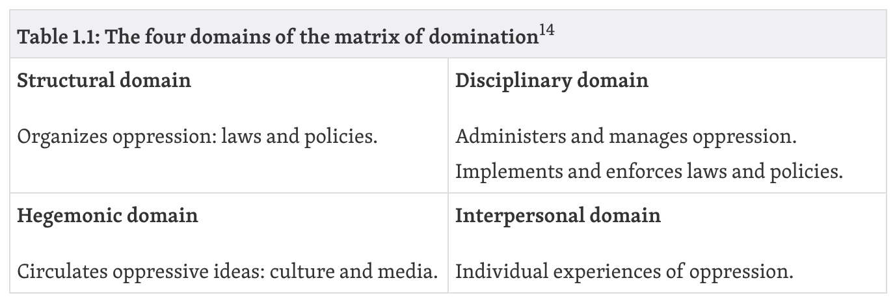

Chapter One of *Data Feminism* delves into the work of an influential sociologist by the name of Patricia Hill Collins. In her pivotal work titled *Black Feminist Thought*, Collins introduces the idea of the _matrix of domination_ to conceptualize how systems of power are organized and subsequently experienced.^(Data Feminism) It is important to note that the term "matrix of domination" was developed by Collins to articulate the interesectional oppression that specifically Black women experience.   

```{r echo=FALSE, out.width= "30%", out.extra='style="padding:10px"', fig.cap="Matrix of Domination described by Patricia Hill Collins"}

```

This particular chapter in *Data Feminism* also describes the power that many large tech companies hold through profiting off of massive amounts of user data and wildly benefitting from the U.S government and economy's capitalist structure. In these same companies, the task of enstilling ethics and harboring safer environments for minoritized groups almost always fall on the members of the minoritized groups themselves.  


- In the event that a member of a minoritized group is unhappy with their position, some remain at these companies, and some leave to find a better workpplace, or to take a stance against the company.

- 

```{r echo=FALSE, out.width= "40%", out.extra='style="padding:10px"', fig.cap="Matrix of Domination described by Patricia Hill Collins"}
knitr::include_graphics("images/patriciahillcollins.jpeg")
```


"If power as domination is organized and operates via intersecting oppressions, then resistance must show comparable complexity."^(Black Feminist Thought)